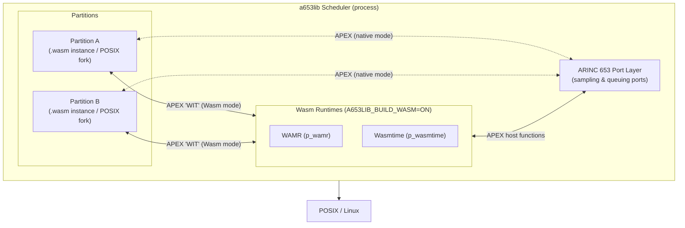

# a653lib

## Introduction

`a653lib` is an [ARINC 653](https://www.aviation-ia.com/products/software-systems) scheduler
library for Linux (POSIX-based). It supports both **native** partition execution (compiled C
binaries) and **WebAssembly** partition execution via the
[WAMR](https://github.com/bytecodealliance/wasm-micro-runtime) and
[Wasmtime](https://wasmtime.dev/) runtimes.

## Features

- ARINC 653 compliant process/partition scheduling on Linux
- Inter-partition communication via ARINC 653 ports (sampling & queuing)
- Native partition execution via POSIX fork
- WebAssembly partition execution via WAMR or Wasmtime (sandboxed, portable)

## WebAssembly Support

When built with `-DA653LIB_BUILD_WASM=ON`, the project compiles additional targets:

| Target       | Description                                                   |
|--------------|---------------------------------------------------------------|
| `p_wamr`     | Partition launcher using WAMR (libiwasm)                      |
| `p_wasmtime` | Partition launcher using Wasmtime (C API)                     |
| `*_wasm`     | Per-partition `.wasm` guest binaries (wasm32-wasip1)          |

The host ARINC 653 functions (sampling/queuing ports, processes, time, semaphores,
etc.) are exposed to the Wasm module via the runtime's import mechanism, with
getters/setters generated by [`c-abi-lens`](https://github.com/DLR-FT/arinc653-wasm)
from the [ARINC 653 headers](https://www.aviation-ia.com/support-files/arinc653h).

This code demonstrates that WAMR and Wasmtime can support ARINC 653 APEX interfaces
as host functions. The proof-of-concept also targets correctness on both
**little-endian and big-endian** architectures (such as PowerPC, still represented
in avionics).

> **Notable:** This is believed to be the first implementation of ARINC 653 APEX
> interfaces as WebAssembly host functions that runs on **two independent runtimes**
> (WAMR and Wasmtime). This satisfies the key advancement criterion of the
> [WebAssembly W3C standardization process](https://github.com/WebAssembly/meetings/blob/main/process/phases.md),
> which requires *"two or more Web VMs have implemented the feature"* to progress
> a proposal to Phase 4 (standardization). While this implementation cannot be
> fully WASI-compliant due to the inherent incompatibilities between the APEX
> interface conventions and the WebAssembly standard (see
> [APEX / WebAssembly Compliance Caveats](#apex--webassembly-compliance-caveats)),
> it fulfils the spirit of the dual-runtime portability requirement that underpins
> the WASI standardization track.

## Architecture



In native mode, partitions run as forked POSIX processes. In Wasm mode, each
partition is instantiated as a Wasm module inside the launcher (`p_wamr` or
`p_wasmtime`), with ARINC 653 host functions injected via the runtime's import API.

## APEX / WebAssembly Compliance Caveats

The WebAssembly specification states that
[functions take a sequence of values as parameters and return a sequence of values as results](https://www.w3.org/TR/wasm-core-2/#concepts%E2%91%A0),
and that [host functions are expressed outside WebAssembly but passed to a module as an import](https://www.w3.org/TR/wasm-core-2/#function-instances%E2%91%A0).

There are a few reasons why ARINC 653 APEX interfaces cannot be 100% compliant
with the WebAssembly standard:

- **WIT bindgen incompatibility** — APEX interfaces defined in WIT will not
  generate the proper standardised APEX function signatures via `wit-bindgen`.
  The APEX interface is therefore exposed as a plain C header that Wasm guest
  sources compile against directly.
- **Function pointers** — `CREATE_PROCESS()` and `CREATE_ERROR_HANDLER()` pass
  a `SYSTEM_ADDRESS_TYPE` function pointer, which cannot comply with the
  WebAssembly standard.
- **Output via pointer parameters** — Wasm specifies that return values are
  passed through a function's return; APEX interfaces instead use plain pointers
  as output parameters.

As long as **C, C++, and Ada** remain the primary partition languages, none of
the above pose a practical concern.

## Operating Systems

Tested on **ArchLinux**, **Ubuntu** (see CI) and RHEL7 (solely native). Expected to work on any Linux 64-bit host.

| Mode            | OS          | Notes                          |
|-----------------|-------------|--------------------------------|
| Native          | Linux 32/64 | POSIX, C99                     |
| Wasm (WAMR)     | Linux 64    | Requires libiwasm              |
| Wasm (Wasmtime) | Linux 64    | Requires Wasmtime C API        |

## Dependencies

### All modes

- CMake ≥ 3.23, C99 compiler (GCC or Clang)
- `awk`, `sed` (for ARINC header processing)
- ARINC 653 header archive (auto-downloaded from AEEC, or supplied via
  `-DARINC653_ZIP=<path>` for offline/Nix builds)

### WebAssembly mode (`-DA653LIB_BUILD_WASM=ON`)

- `wasi-sysroot` — set via `-DWASI_SYSROOT=` (default: `/usr/share/wasi-sysroot`)
- `clang` with `wasm32-wasip1` target — set via `-DWASM_CLANG=`
- **WAMR launcher**: `libiwasm` — auto-detected, or set via `-DIWASM_LIBRARY=`
- **Wasmtime launcher**: `libwasmtime` — auto-detected, or set via `-DWASMTIME_LIBRARY=`
- **c-abi-lens** (Rust/Cargo) — auto-fetched and built, or supply a prebuilt
  binary via `-DC_ABI_LENS_EXECUTABLE=`; disable auto-fetch with
  `-DA653LIB_FETCH_C_ABI_LENS=OFF`

### ArchLinux

```sh
yay -S clang lld wasi-libc wasi-compiler-rt libwasmtime iwasm
```

> **Note**: The `iwasm` AUR PKGBUILD must be patched to not strip the static
> library. See the [iwasm AUR package](https://aur.archlinux.org/packages/iwasm).

### Ubuntu

See CI configuration.

## Compilation

### Native (default)

```sh
cmake -S . -B build
cmake --build build
```

There will be the following files in the `build` dir:

- `a653lib_main`
- `liba653lib.a`
- `liba653lib_partition_init.a`
- `Makefile`
- `partition_a`
- `partition_b`
- ...

### With WebAssembly support

```sh
cmake -S . -B build-wasm \
  -DA653LIB_BUILD_WASM=ON \
  -DWASI_SYSROOT=/opt/wasi-sdk/share/wasi-sysroot \
  -DWASM_CLANG=/opt/wasi-sdk/bin/clang
cmake --build build-wasm
cmake --build build-wasm --target wasm   # builds p_wamr, p_wasmtime + .wasm guests
```

### Key CMake options

| Option                       | Default                        | Description                                      |
|------------------------------|--------------------------------|--------------------------------------------------|
| `A653LIB_BUILD_WASM`         | `OFF`                          | Enable Wasm guest and launcher targets           |
| `A653LIB_FETCH_C_ABI_LENS`   | `ON`                           | Auto-clone and build c-abi-lens                  |
| `WASI_SYSROOT`               | `/usr/share/wasi-sysroot`      | WASI sysroot for guest compilation               |
| `WASM_CLANG`                 | `clang`                        | Clang used for wasm32-wasip1 guest compilation   |
| `IWASM_LIBRARY`              | *(auto-detected)*              | Path to `libiwasm.a` or shared lib               |
| `WASMTIME_LIBRARY`           | *(auto-detected)*              | Path to `libwasmtime`                            |
| `C_ABI_LENS_EXECUTABLE`      | *(built from source)*          | Path to a prebuilt `c-abi-lens` binary           |
| `ARINC653_ZIP`               | *(downloaded)*                 | Path to a pre-fetched `arinc653.h.zip`           |

## Run Demo

### Native

```sh
./build/a653lib_main
```
this will generate the following output:
```text
pid: 578773 <1702486050.317812578>: Current local time and date: Wed Dec 13 17:47:30 2023

pid: 578773 <1702486050.318212993>: a653_shm id: 0x63801e ptr: 0x7f5e57802000

pid: 578773 <1702486050.318233554>: > taskset --cpu-list 0 ./partition_a & :

pid: 578773 <1702486050.349241033>: a653 start (other pid) 578775

pid: 578773 <1702486050.349254883>: > taskset --cpu-list 1 ./partition_b & :
```

### WebAssembly (WAMR)

```sh
cd ./build-wasm
ln -sf p_wamr wasm32_rt
./a653_main_wasm
```

### WebAssembly (Wasmtime)

```sh
cd ./build-wasm
ln -sf p_wasmtime wasm32_rt
./a653_main_wasm
```

The build produces a `bin/` directory. Switch the `wasm32_rt` symlink between
`p_wamr` and `p_wasmtime` to select the WebAssembly runtime.

## Limitations

- not all functionality is implemented now, but partitions with Processes using sampling and queueing ports
  is shown by the demonstration code.
- not implemented function are implemented as empty functions and will be added if needed step by step.
- Linux only (no bare-metal or RTOS support)
- WebAssembly mode requires a 64-bit host (little-endian or big-endian)

## Open Topics

- Ensure Wasm is also handled through NixOS CI builds
- Improve threading model — see
  [dev/add-wasm-apex-proc-alloc](https://github.com/DLR-FT/arinc653-wasm/compare/main...dev/add-wasm-apex-proc-alloc)

## Contributing

See [CONTRIBUTING.md](CONTRIBUTING.md).

## License

`SPDX-License-Identifier: Apache-2.0 OR MIT`

See [LICENSE](LICENSE.md).
